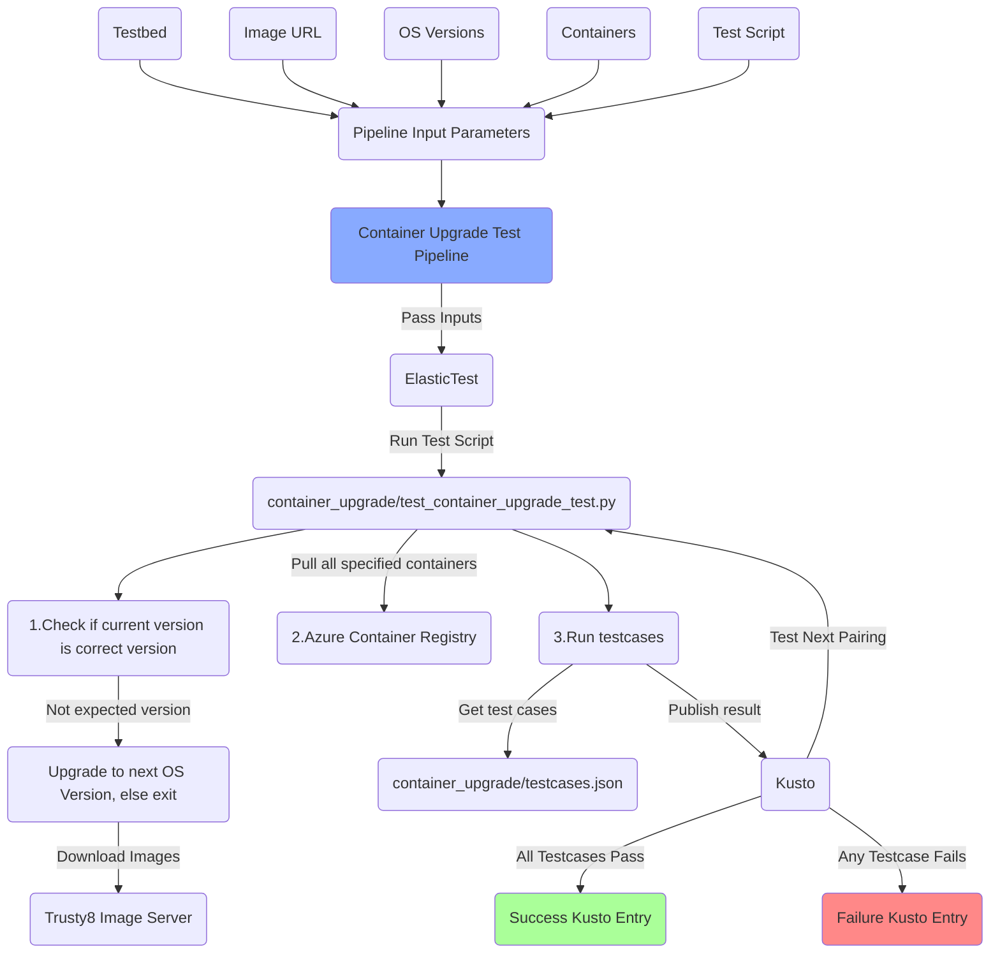

```mermaid
flowchart
    Start(Container Upgrade Test Pipeline)
    style Start fill:#8AF
    Pipeline_Inputs(Pipeline Input Parameters)
    Testbed(Testbed)
    Image_URL(Image URL)
    OS_Versions(OS Versions)
    Containers(Containers)
    Script(Test Script)
    ElasticTest(ElasticTest)
    Container_Upgrade_Test_Script(container_upgrade/test_container_upgrade_test.py)
    OS_Version_Check(1.Check if current version is correct version)
    Upgrade(Upgrade to next OS Version, else exit)
    ACR(2.Azure Container Registry)
    Trusty8(Trusty8 Image Server)
    Testcase_File(container_upgrade/testcases.json)
    Execute_Test(3.Run testcases)
    Kusto(Kusto)
    Kusto_Success(Success Kusto Entry)
    style Kusto_Success fill:#AF9
    Kusto_Failure(Failure Kusto Entry)
    style Kusto_Failure fill:#F88

    Testbed -->Pipeline_Inputs
    Image_URL -->Pipeline_Inputs
    OS_Versions -->Pipeline_Inputs
    Containers -->Pipeline_Inputs
    Script -->Pipeline_Inputs
    Pipeline_Inputs -->Start
    Start -->|Pass Inputs|ElasticTest
    ElasticTest -->|Run Test Script|Container_Upgrade_Test_Script
    Container_Upgrade_Test_Script -->OS_Version_Check
    OS_Version_Check -->|Not expected version|Upgrade
    Upgrade -->|Download Images|Trusty8
    Container_Upgrade_Test_Script -->|Pull all specified containers|ACR
    Container_Upgrade_Test_Script -->Execute_Test
    Execute_Test -->|Get test cases|Testcase_File
    Execute_Test -->|Publish result|Kusto
    Kusto -->|All Testcases Pass|Kusto_Success
    Kusto -->|Any Testcase Fails|Kusto_Failure
    Kusto -->|Test Next Pairing|Container_Upgrade_Test_Script
```
