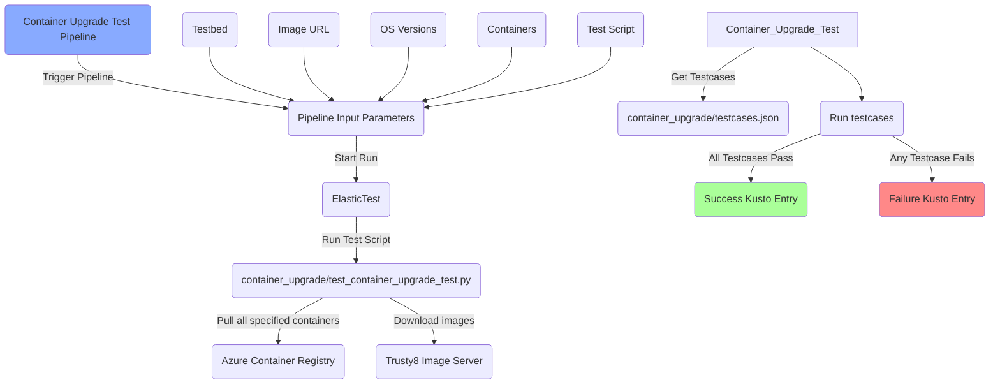

```mermaid
flowchart
    Start(Container Upgrade Test Pipeline)
    style Start fill:#8AF
    Pipeline_Inputs(Pipeline Input Parameters)
    Testbed(Testbed)
    Image_URL(Image URL)
    OS_Versions(OS Versions)
    Containers(Containers)
    Script(Test Script)
    ElasticTest(ElasticTest)
    Container_Upgrade_Test_Script(container_upgrade/test_container_upgrade_test.py)
    ACR(Azure Container Registry)
    Trusty8(Trusty8 Image Server)
    Testcase_File(container_upgrade/testcases.json)
    Execute_Test(Run testcases)
    Kusto_Success(Success Kusto Entry)
    style Kusto_Success fill:#AF9
    Kusto_Failure(Failure Kusto Entry)
    style Kusto_Failure fill:#F88

    Start -->|Trigger Pipeline|Pipeline_Inputs
    Testbed -->Pipeline_Inputs
    Image_URL -->Pipeline_Inputs
    OS_Versions -->Pipeline_Inputs
    Containers -->Pipeline_Inputs
    Script -->Pipeline_Inputs
    Pipeline_Inputs -->|Start Run|ElasticTest
    ElasticTest -->|Run Test Script|Container_Upgrade_Test_Script
    Container_Upgrade_Test_Script -->|Pull all specified containers|ACR
    Container_Upgrade_Test_Script -->|Download images|Trusty8
    Container_Upgrade_Test -->|Get Testcases|Testcase_File
    Container_Upgrade_Test -->Execute_Test
    Execute_Test -->|All Testcases Pass|Kusto_Success
    Execute_Test -->|Any Testcase Fails|Kusto_Failure 
```
