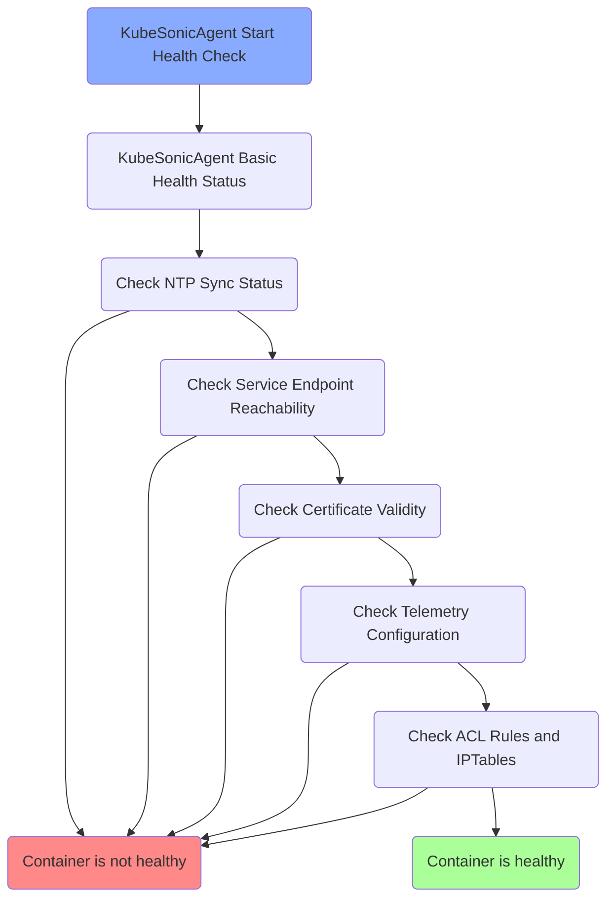

```mermaid
flowchart
    Start(KubeSonicAgent Start Health Check)
    style Start fill:#8AF
    Health_Status(KubeSonicAgent Basic Health Status)
    NTP_Sync(Check NTP Sync Status)
    Unhealthy(Container is not healthy)
    style Unhealthy fill:#F88
    Endpoint_Reachability(Check Service Endpoint Reachability)
    Cert_Validity(Check Certificate Validity)
    Telemetry_Config(Check Telemetry Configuration)
    ACL_Rules(Check ACL Rules and IPTables)
    Healthy(Container is healthy)
    style Healthy fill:#AF9

    Start --> Health_Status
    Health_Status --> NTP_Sync
    NTP_Sync --> Unhealthy
    NTP_Sync --> Endpoint_Reachability
    Endpoint_Reachability --> Unhealthy
    Endpoint_Reachability --> Cert_Validity
    Cert_Validity --> Unhealthy
    Cert_Validity --> Telemetry_Config
    Telemetry_Config --> Unhealthy
    Telemetry_Config --> ACL_Rules
    ACL_Rules --> Unhealthy
    ACL_Rules --> Healthy
```
