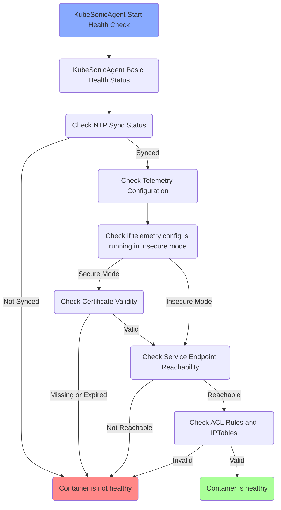

```mermaid
flowchart
    Start(KubeSonicAgent Start Health Check)
    style Start fill:#8AF
    Health_Status(KubeSonicAgent Basic Health Status)
    NTP_Sync(Check NTP Sync Status)
    Unhealthy(Container is not healthy)
    style Unhealthy fill:#F88
    Telemetry_Config(Check Telemetry Configuration)
    Cert_Config(Check if telemetry config is running in insecure mode)
    Cert_Validity(Check Certificate Validity)
    Endpoint_Reachability(Check Service Endpoint Reachability)
    ACL_Rules(Check ACL Rules and IPTables)
    Healthy(Container is healthy)
    style Healthy fill:#AF9

    Start --> Health_Status
    Health_Status --> NTP_Sync
    NTP_Sync -->|Not Synced|Unhealthy
    NTP_Sync -->|Synced|Telemetry_Config
    Telemetry_Config -->Cert_Config
    Endpoint_Reachability -->|Not Reachable|Unhealthy
    Endpoint_Reachability -->|Reachable|ACL_Rules
    Cert_Config -->|Secure Mode|Cert_Validity
    Cert_Config -->|Insecure Mode|Endpoint_Reachability
    Cert_Validity -->|Missing or Expired|Unhealthy
    Cert_Validity -->|Valid|Endpoint_Reachability
    ACL_Rules -->|Invalid|Unhealthy
    ACL_Rules -->|Valid|Healthy
```
