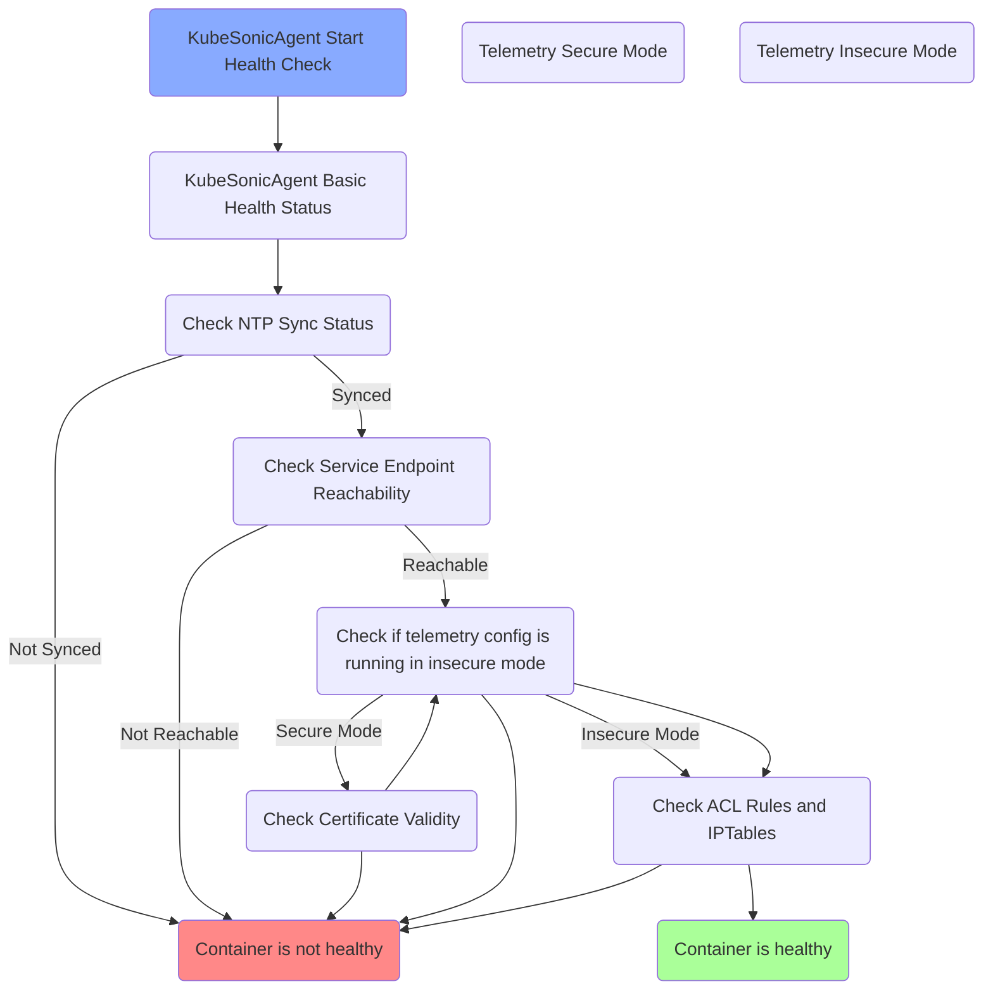

```mermaid
flowchart
    Start(KubeSonicAgent Start Health Check)
    style Start fill:#8AF
    Health_Status(KubeSonicAgent Basic Health Status)
    NTP_Sync(Check NTP Sync Status)
    Unhealthy(Container is not healthy)
    style Unhealthy fill:#F88
    Endpoint_Reachability(Check Service Endpoint Reachability)
    Telemetry_Config(Check if telemetry config is running in insecure mode)
    Secure_mode(Telemetry Secure Mode)
    Insecure_mode(Telemetry Insecure Mode)
    Cert_Validity(Check Certificate Validity)
    ACL_Rules(Check ACL Rules and IPTables)
    Healthy(Container is healthy)
    style Healthy fill:#AF9

    Start --> Health_Status
    Health_Status --> NTP_Sync
    NTP_Sync -->|Not Synced|Unhealthy
    NTP_Sync -->|Synced|Endpoint_Reachability
    Endpoint_Reachability -->|Not Reachable|Unhealthy
    Endpoint_Reachability -->|Reachable|Telemetry_Config
    Telemetry_Config -->|Secure Mode|Cert_Validity
    Telemetry_Config -->|Insecure Mode|ACL_Rules
    Cert_Validity --> Unhealthy
    Cert_Validity --> Telemetry_Config
    Telemetry_Config --> Unhealthy
    Telemetry_Config --> ACL_Rules
    ACL_Rules --> Unhealthy
    ACL_Rules --> Healthy
```
