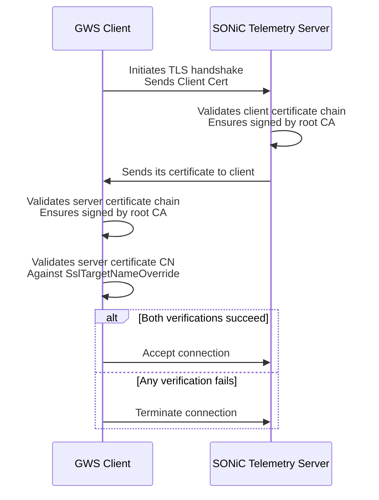

```mermaid
sequenceDiagram
    participant C as GWS Client
    participant S as SONiC Telemetry Server


    C->>S: Initiates TLS handshake<br/>Sends Client Cert
    S->>S: Validates client certificate chain<br/>Ensures signed by root CA
    S->>C: Sends its certificate to client
    C->>C: Validates server certificate chain<br/>Ensures signed by root CA
    C->>C: Validates server certificate CN<br/>Against SslTargetNameOverride
    alt Both verifications succeed
        C->>S: Accept connection
    else Any verification fails
        C->>S: Terminate connection
    end
```
